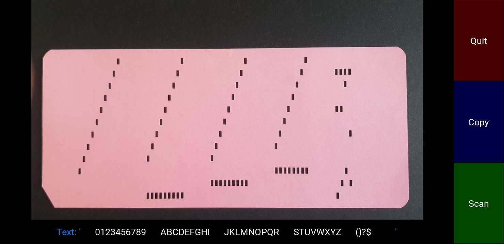

# PunchCardReader
Android kivy app to decode punch cards (IBM type, 12 rows, 80 rows) by taking a photo of the punch card. Best results if the back of the card on a black surface is photographed.

For Kivy see: https://kivy.org/

To build use buildozer: https://buildozer.readthedocs.io/en/latest/index.html

with: https://github.com/kivy/python-for-android/blob/develop/ci/makefiles/android.mk
    
    export LEGACY_NDK=~/.android/android-ndk-legacy

otherwise the following error occurs:

Build failed: Please set the environment variable 'LEGACY_NDK' to point to a NDK location with gcc/gfortran support (supported NDK version: 'r21e')

Note: this app uses the 8.4. version of Pillow (PIL) due to build recipes for kivy/python-for-android. Could not use PIL version 9.2.0

Linux:

    time buildozer android debug
    buildozer -v android deploy run

Under Windows, use WSL  (WSL2). But must install also the windows version of adb
https://buildozer.readthedocs.io/en/latest/quickstart.html#run-my-application-from-windows-10

    buildozer android debug 2>&1 | tee build.log && buildozer -v android deploy run
    
Here is a screenshot of the app. Snapshot of the back of a punch card to get better results without disturbing text.      


The algorithm runs as follows:
```
in main.py:
    user interface built with kivy
    take picture
    store as png
    call code in readPunchCard.py and get result
    display resulting text
    button "Copy" to copy resulting text to clipboard
in readPunchCard.py    
    read png
    convert to grayscale image
    if portrait rotate to landscape
    enhance contrast
    check if too dark, light, too low contrast
    check if dark/black background present
    convert image to black and white
    remove small white regions  (possible distortions)
    remove small black holes    (possible distortions)
    produce image of unpunched card by closing all holes
    find bounding box of unpunched card
    crop unpunched card image by the above bounding box
    crop punched card image by the above bounding box
    create image by subtracting the punched card image from the unpunched card image, thus only the punches remain
    find the card borders by scanning the unpunched card horizontally and vertically
        the result is a quadrangle because the taken picture can have a persective distoring a rectangle to a quadrangle 
    get the corners of the quadrangle
    draw the quadrangle for debugging purpuses
    do a QUAD image transform to get the rectified image
    do a QUAD image transform also for the unpunched card image
    extract the 4 corners of the unpunched card image and check which has the lowest brightness
        the corner with the lowest brightness is the corner with the bevel
    depending where the bevel is keep, flip, mirror, or rotate the image
    invert the image, now card is white and holes are black
    find coords of all holes
    create an ideal punch card image with all possible holes as a reference card
    scan columns
        pass1: scan all rows and check for mean x position wrt to ideal card. Set a xDeviation
        pass2: with the xDeviation check overlap of punch with ideal card. Store if overlap
    translate the found holes to text
    create an image showing the difference between the ideal card and the punched image and save image to png file
    return text
```
